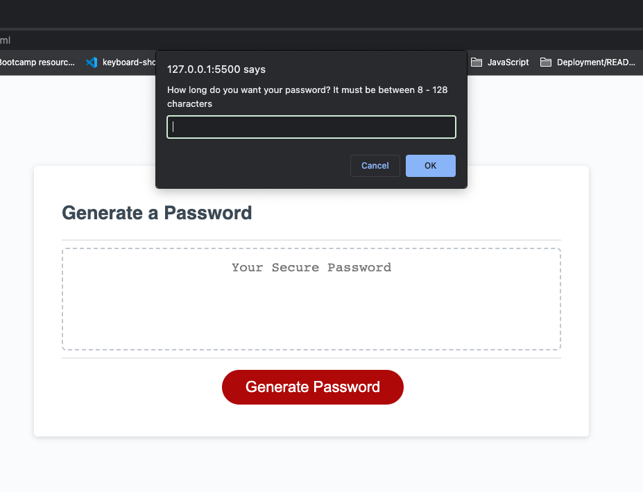
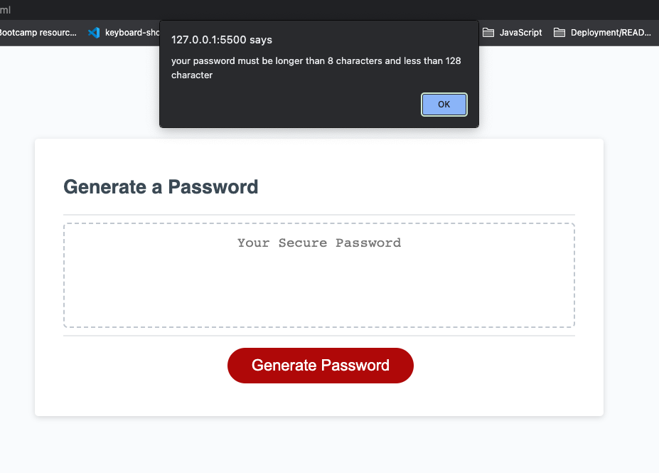
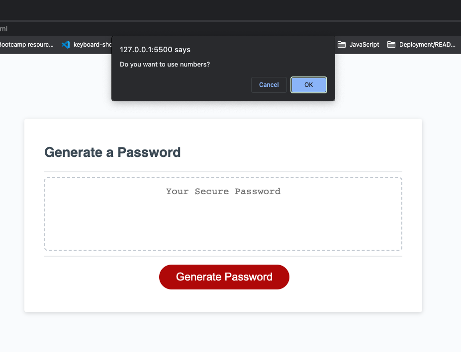
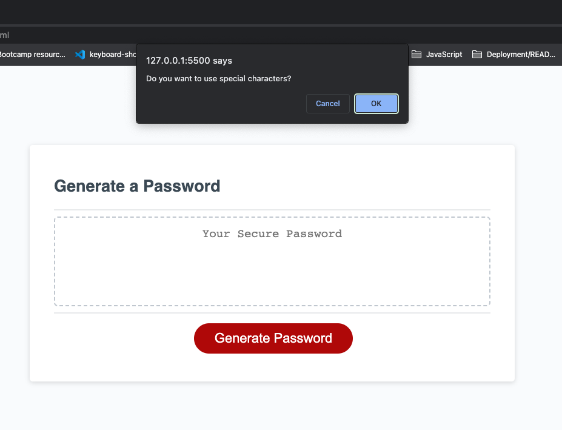
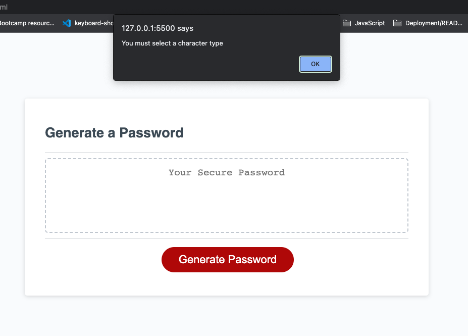
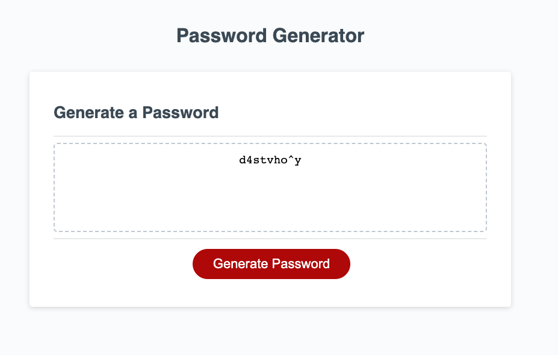

#Module 3 challenge - due 1 December 2022

##User Story and Acceptance Criteria provided for Project
###User Story
* AS AN employee with access to sensitive data
* I WANT to randomly generate a password that meets certain criteria
* SO THAT I can create a strong password that provides greater security

###Acceptance Criteria
* GIVEN I need a new, secure password
* WHEN I click the button to generate a password
* THEN I am presented with a series of prompts for password criteria
* WHEN prompted for password criteria
* THEN I select which criteria to include in the password
* WHEN prompted for the length of the password
* THEN I choose a length of at least 8 characters and no more than 128 characters
* WHEN asked for character types to include in the password
* THEN I confirm whether or not to include lowercase, uppercase, numeric, and/or special characters
* WHEN I answer each prompt
* THEN my input should be validated and at least one character type should be selected
* WHEN all prompts are answered
* THEN a password is generated that matches the selected criteria
* WHEN the password is generated
* THEN the password is either displayed in an alert or written to the page

##Description

###Why did you build this project?
This project was built to create a random password within a user defined criteria.

###What problem(s) does it solve?
It provided me with the space to practice and develop my JavaScript skills.

###What did you learn?
* addEventListener
* functions
* return
* what an event is within js

##Installation
https://caoimhejyoti.github.io/mod3-challenge/

##Usage
This password generator is to be used within a browser. 

1. User selected the 'Generate Password" button to trigger event

 Once this event is triggered, you are asked a series of questions.

2. The first questions is the desired length of you password.

 If this length is not within the desired range (8-128 characters), you will be prompted to enter an appropriate number. 

3. Once the appropriate length of characters is entered, you are then asked which options you want to use for your password.

4. If you have not selected a character type, you will be alerted and the process will start again.

_I would like to develop this step to start from number 3, not the current start, number 2._ 

5. Once all of these questioned are answered, your password will pop up on the welcome page in the password container.

##Credits
https://stackoverflow.com/questions/38620152/pick-a-random-letter-from-string-in-javascript
https://www.w3schools.com/js/js_random.asp'
https://www.geeksforgeeks.org/generate-random-string-of-given-size-in-java/

##License
Please refer to the LICENSE in the repo.